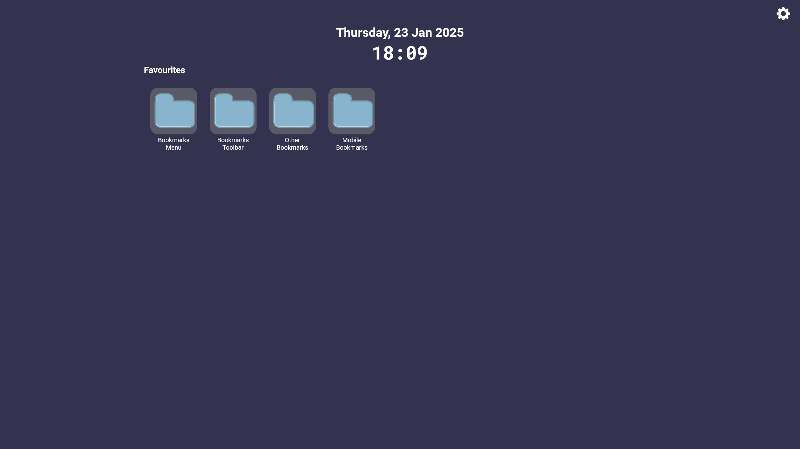

#   Tabby New Tabs

A lightweight new tab page wrapped for the Manifest V3 browser extension platform.

## Downloads

- [Firefox](https://addons.mozilla.org/en-GB/firefox/addon/tabby-new-tab/)
- Chrome/ Edge (coming soon)

## Features

It's currently in a very early state, but intended features include the following:

- [x] Viewing your browser bookmarks
- [ ] Viewing recently closed or often used tabs
- [x] Clock 
- [ ] Toggling which elements are visible 
- [x] Colour scheme editing
- [x] Saving settings
- [x] Custom background
- [ ] Custom fonts
